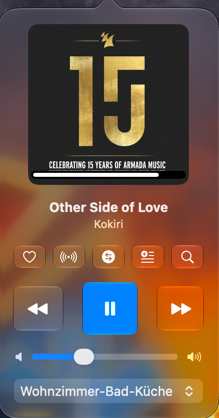
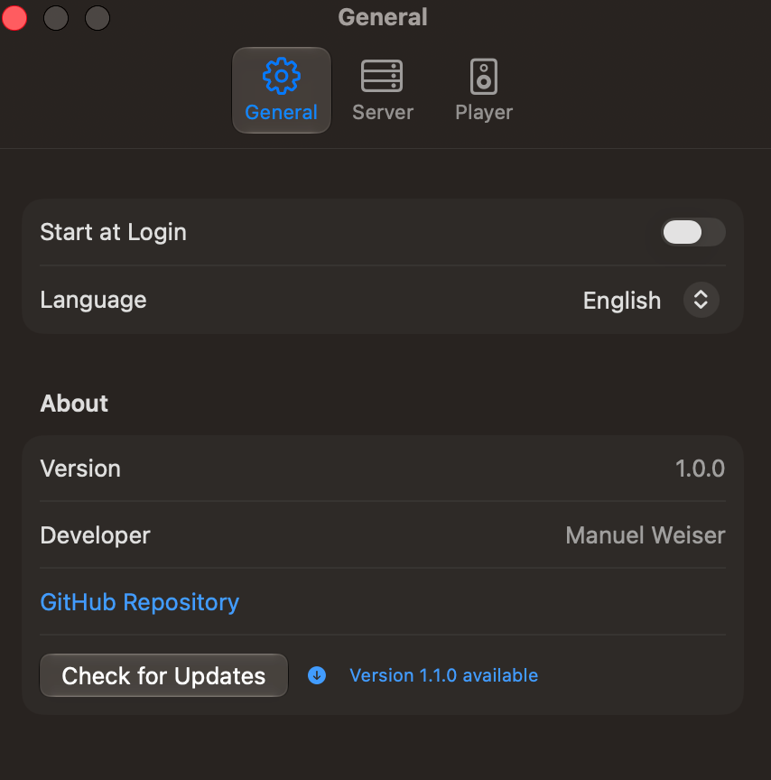
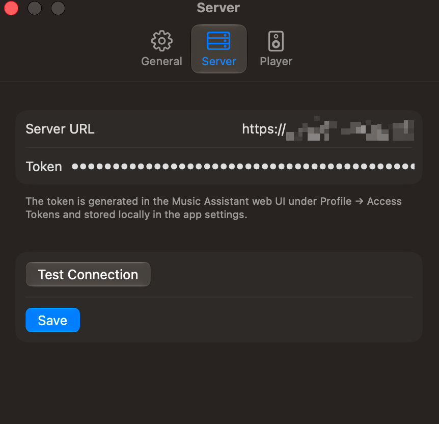
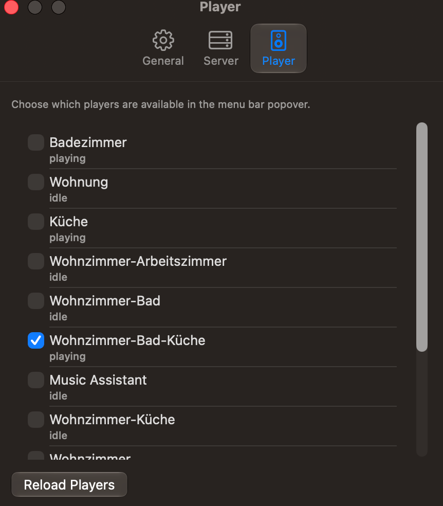

# MusicAssistant-Mac-Menubar

🇬🇧 [English](README.md)

Natives macOS-Menüleisten-Tool für [Music Assistant](https://www.music-assistant.io/) (MA). Steuere deinen aktuell laufenden Player direkt aus der Menüleiste — Cover, Titel/Künstler, Transport-Controls, Lautstärke, Favoriten, Radio, Smart Crossfade, Playlists und eine vollwertige Suche — ohne die MA-Web-UI oder eine Companion-App öffnen zu müssen.



## Funktionen

- Icon in der Menüleiste, Klick öffnet ein Popover mit Cover (inkl. Fortschrittsbalken), Titel/Künstler und Transport-Controls (⏮ ⏯ ⏭) sowie einem Lautstärkeregler.
- Steuerung eines aktiven Players, wechselbar über einen Picker im Popover.
- Aktuellen Titel als Favorit markieren, Radio-Wiedergabe mit ähnlichen Titeln starten, Smart Crossfade pro Player ein-/ausschalten.
- Aktuellen Titel per Klick zu einer vorhandenen oder neu anzulegenden MA-Playlist hinzufügen.
- Eigenes Such-Fenster für Titel, Alben, Playlists und Interpreten, inkl. Provider-Filter und Playlist-Übersicht.
- Alle Icon-Buttons haben Tooltips (Mouseover), die erklären, was sie tun.
- Rechtsklick auf das Icon öffnet ein Menü mit „Einstellungen…" und „Beenden".
- Settings-Dialog zum Einstellen von Server-URL, Access-Token, einer Whitelist der wählbaren MA-Player, „Bei Anmeldung starten" sowie der App-Sprache.
- Mehrsprachig (Deutsch/Englisch): folgt automatisch der Systemsprache (Fallback Englisch), in den Einstellungen manuell überschreibbar.
- Automatischer Reconnect mit Backoff, Live-Updates über die MA-WebSocket-Events (kein Polling), Verbindungsstatus-Anzeige im Popover.
- Automatische Prüfung auf neue Versionen (GitHub Releases).
- Reine Menüleisten-App ohne Dock-Icon (`LSUIElement`).

## Installation

### Per DMG-Download

Die aktuellste Version von der [GitHub-Releases-Seite](https://github.com/ManuelW77/MusicAssistant-Mac-Menubar/releases/latest) herunterladen (`MA-Menubar-vX.Y.Z.dmg`), öffnen und „MA Menubar.app" nach `/Applications` ziehen. Das DMG ist signiert und bei Apple notarisiert — kein Gatekeeper-Rechtsklick-Umweg nötig.

### Per Homebrew

```
brew tap ManuelW77/musicassistant-mac-menubar https://github.com/ManuelW77/MusicAssistant-Mac-Menubar
brew install --cask ma-menubar
```

Die Cask-Formel (`Casks/ma-menubar.rb`) liegt bewusst im Hauptrepo statt in einem separaten `homebrew-*`-Tap-Repo — dafür ist beim `brew tap` die volle Repo-URL statt der Kurzform nötig. Sie wird bei jedem Release automatisch auf die neue Version/den neuen SHA256 aktualisiert (`.github/workflows/release.yml`).

## Voraussetzungen

- macOS 26+ (Liquid-Glass-UI)
- Xcode mit swift-tools-version 6.2+
- Ein laufender Music-Assistant-Server sowie ein Long-Lived Access Token (MA-Web-UI → Profil → Access Tokens)

## Projektstruktur

```
Shared/            SPM-Library "MAMenubarLib": WebSocket-Client, Datenmodelle,
                    Settings-Speicher, Lokalisierung, AppState-Orchestrator
App/                SwiftUI-App (MenuBarExtra-Popover + Settings-Dialog)
Tools/VerifyConnection/  CLI zur Protokollverifikation gegen einen echten Server
MAMenubarTests/     Unit-Tests für Shared/
```

Es gibt bewusst kein `.xcodeproj` — das Projekt ist ein reines Swift Package. Xcode kann `Package.swift` direkt öffnen und daraus bauen/debuggen.

## Bauen & Starten

### Mit Xcode (empfohlen für Entwicklung)

```
open Package.swift
```

Im Schema-Dropdown **„MAMenubar"** auswählen (nicht `VerifyConnection` oder `MAMenubarTests`) und ⌘R. Da `LSUIElement = YES` gesetzt ist, öffnet sich kein Fenster — die App erscheint nur als Icon in der Menüleiste.

### Mit der Kommandozeile

```
make build   # swift build (Debug)
make test    # swift test
make run     # Debug-Build, ad-hoc/zertifikatssigniert, direkt starten
```

### Fertiges `.app`-Bundle bauen

```
make app
```

Baut Release-optimiert und erzeugt ein doppelklickbares Bundle unter `dist/MA Menubar.app`, das sich z.B. nach `/Applications` verschieben lässt:

```
mv "dist/MA Menubar.app" /Applications/
```

`run` und `app` signieren standardmäßig mit dem lokalen Zertifikat `Apple Development: Manuel Weiser (469HR6FMTH)` aus der Keychain (siehe `SIGN_IDENTITY` im `Makefile`). Auf einem Rechner ohne dieses Zertifikat mit `make app SIGN_IDENTITY=-` auf Ad-hoc-Signatur zurückfallen.

## Signierte Releases (GitHub Actions)

Das Repo wird zusätzlich zu Gitea (`origin`) nach GitHub gespiegelt (`github`-Remote, https://github.com/ManuelW77/MusicAssistant-Mac-Menubar). Ein Push eines `vX.Y.Z`-Tags dorthin (oder ein manueller Trigger) löst `.github/workflows/release.yml` aus: baut per `make app`, signiert mit einem **Developer-ID-Application**-Zertifikat, notarisiert bei Apple (`notarytool`) und hängt ein gestapeltes Drag-in-Applications-`.dmg` (`make dmg`) an eine neue GitHub Release — Gatekeeper zeigt auf fremden Macs dann keine Warnung mehr.

Lokal lässt sich das `.dmg` nach einem `make app` auch separat erzeugen:

```
make dmg
```

Versionierung folgt [SemVer](https://semver.org/), beginnend bei `v1.0.0`. Bei einem Tag-Push übernimmt der Workflow den Tag automatisch als `CFBundleShortVersionString` (Tag ohne führendes `v`) und die GitHub-Actions-Run-Nummer als `CFBundleVersion` (Build-Nummer) — `App/Info.plist` muss dafür nicht manuell angepasst werden.

**Branch-Modell**: `devel` ist der Arbeits-Branch (geht an Gitea `origin/devel`), `main` ist ein reiner Release-Spiegel — er wird nur beim Release aktualisiert und dann zu `origin` **und** `github` gepusht. Ein Release auslösen:

```
git checkout main
git merge devel
make release              # Patch-Bump, z.B. 1.0.0 -> 1.0.1
make release BUMP=minor   # Minor-Bump
make release BUMP=v2.0.0  # explizite Version
```

`scripts/release.sh` bricht ab, wenn man sich nicht auf `main` befindet oder der Working Tree nicht sauber ist, fragt vor dem Push nochmal nach und pusht dann `main` + den neuen Tag zu beiden Remotes — der Tag-Push zu GitHub löst den Sign-&-Notarize-Workflow aus. Beim Aufruf ganz ohne Argument (`make release`) zeigt es zuerst die aktuelle Version und fragt dann interaktiv, ob `major`, `minor` oder `patch` erhöht werden soll (Standard bei leerer Eingabe: `patch`); bei explizitem `BUMP=...` entfällt diese Rückfrage.

Dafür müssen einmalig folgende Repo-Secrets gesetzt werden (`gh secret set NAME --repo ManuelW77/MusicAssistant-Mac-Menubar -b"…"`, selbst ausführen — dafür wird das Zertifikat/die Credentials nirgendwo sonst eingegeben):

| Secret | Herkunft |
|---|---|
| `MACOS_CERTIFICATE_P12_BASE64` | Developer-ID-Application-Zertifikat + privater Schlüssel aus Keychain Access als `.p12` exportieren, dann `base64 -i certificate.p12` |
| `MACOS_CERTIFICATE_PASSWORD` | Passwort, das beim `.p12`-Export vergeben wurde |
| `KEYCHAIN_PASSWORD` | Beliebiges Passwort nur für die temporäre CI-Keychain, z.B. `openssl rand -base64 24` |
| `DEVELOPER_ID_IDENTITY` | Exakter Identity-String, z.B. `Developer ID Application: Manuel Weiser (TEAMID)` (siehe `security find-identity -v -p codesigning`) |
| `NOTARY_KEY_ID` / `NOTARY_ISSUER_ID` / `NOTARY_KEY_P8_BASE64` | App Store Connect → Users and Access → Integrations → App Store Connect API: Key erzeugen (Rolle „Developer" reicht), `.p8` einmalig herunterladen und `base64 -i AuthKey_XXXX.p8` |

## Konfiguration

Beim ersten Start über Rechtsklick auf das Menüleisten-Icon → „Einstellungen…":

1. **Tab „Allgemein"**: optional „Bei Anmeldung starten" aktivieren (nutzt `SMAppService.mainApp` — funktioniert nur aus einem echten `.app`-Bundle, nicht aus dem rohen Debug-Build). App-Sprache wählen (Systemsprache / Deutsch / English). Zeigt außerdem aktuelle Version, Entwickler und GitHub-Link, und prüft beim Öffnen automatisch (sowie über „Nach Updates suchen") gegen die GitHub-Releases-API, ob eine neuere Version verfügbar ist.

   

2. **Tab „Server"**: Server-Basis-URL (z.B. `https://music.example.org`) und Access-Token eintragen, mit „Verbindung testen" prüfen, dann „Speichern".

   

3. **Tab „Player"**: Aus den vom Server gemeldeten Playern die gewünschten für den Popover-Picker aktivieren.

   

Server-URL, Access-Token, Player-Whitelist und Sprache liegen in `UserDefaults` (bewusst nicht in der Keychain — der dafür beim allerersten Speichern unvermeidbare "App möchte auf deinen Schlüsselbund zugreifen"-Dialog wurde zugunsten einer reibungslosen Ersteinrichtung vermieden; der Token liegt dadurch unverschlüsselt auf der Platte).

## Protokollverifikation gegen einen echten Server

Die Music-Assistant-WebSocket-API ist nicht vollständig dokumentiert; `Tools/VerifyConnection` prüft Connect/Auth/Player-Liste gegen einen echten Server, ohne die UI zu bauen:

```
make verify URL=https://music.example.org TOKEN=<dein-token>
```

## Tests

```
make test
```

Deckt u.a. das JSON-Decoding (inkl. Partial-Response-Handling der MA-API), die Bild-URL-Auflösung (`MassEndpoint`, inkl. Umschreiben privater LAN-Adressen auf die öffentliche Server-URL), Settings-Roundtrips sowie die Vollständigkeit der Übersetzungstabelle ab.
