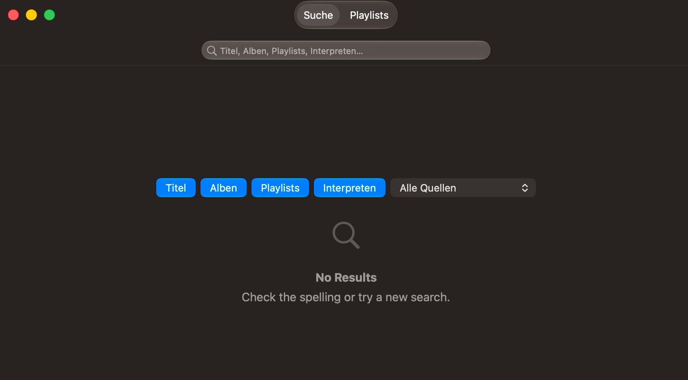
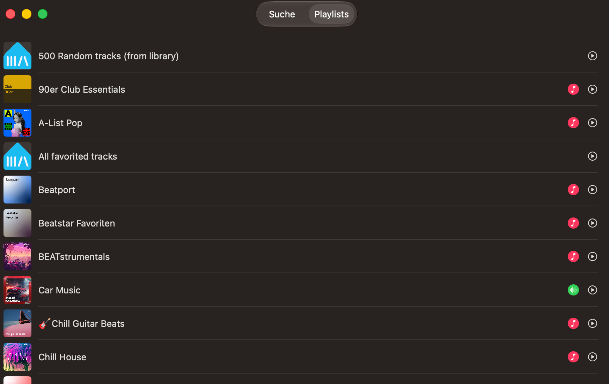

# MusicAssistant-Mac-Menubar

🇩🇪 [Deutsch](README.de.md) · [Privacy Policy](PRIVACY.md)

A native macOS menu bar client for [Music Assistant](https://www.music-assistant.io/) (MA). Control your currently playing player right from the menu bar — cover art, title/artist, transport controls, volume, favorites, radio, smart crossfade, playlists, and a full search — without opening the MA web UI or a companion app.


## Features

- Menu bar icon; click opens a popover with cover art (incl. progress bar), title/artist, transport controls (⏮ ⏯ ⏭), and a volume slider.
- Control one active player, switchable via a picker in the popover.
- Toggle the current track as a favorite, start radio playback with similar tracks, toggle Smart Crossfade per player.
- Add the current track to an existing or newly created MA playlist with a click.
- A dedicated search window for tracks, albums, playlists and artists, with a provider filter and a playlists overview.
- Every icon button has a tooltip (on hover) explaining what it does.
- Right-click the icon opens a menu with "Settings…" and "Quit".
- Settings dialog for server URL, access token, a whitelist of selectable MA players, "Start at Login", and the app language.
- Multi-language (German/English): follows the system language automatically (falls back to English), overridable manually in Settings.
- Automatic reconnect with backoff, live updates via MA WebSocket events (no polling), connection status indicator in the popover.
- Automatic check for new releases (GitHub Releases).
- Pure menu bar app with no Dock icon (`LSUIElement`).

## Search

Click the magnifying glass in the popover to open a dedicated search window: search across tracks, albums, playlists and artists at once, with type filters and a provider filter.



The second tab lists all your library playlists directly, without typing a query.



## Configuration

On first launch, right-click the menu bar icon → "Settings…":

1. **"General" tab**: optionally enable "Start at Login" (uses `SMAppService.mainApp` — only works from a real `.app` bundle, not from the raw debug build). Choose the app language (System / Deutsch / English). Also shows the current version, developer, and GitHub link, and automatically checks (on open, and via "Check for Updates") against the GitHub Releases API whether a newer version is available.

   

2. **"Server" tab**: enter the server base URL (e.g. `https://music.example.org`) and access token, verify with "Test Connection", then "Save".

   

3. **"Player" tab**: from the players reported by the server, enable the ones you want in the popover picker.

   

Server URL, access token, player whitelist, and language live in `UserDefaults` (deliberately not in the Keychain — the unavoidable "app wants to access your keychain" dialog on the very first save was traded away in favor of a friction-free first run; the token sits unencrypted on disk as a result).

## Installation

### Via DMG download

Download the latest version from the [GitHub releases page](https://github.com/ManuelW77/MusicAssistant-Mac-Menubar/releases/latest) (`MA-Menubar-vX.Y.Z.dmg`), open it, and drag "MA Menubar.app" into `/Applications`. The DMG is signed and notarized by Apple — no Gatekeeper right-click workaround needed.

### Via Homebrew

```
brew tap ManuelW77/musicassistant-mac-menubar https://github.com/ManuelW77/MusicAssistant-Mac-Menubar
brew trust manuelw77/musicassistant-mac-menubar
brew install --cask ma-menubar
```

The cask formula (`Casks/ma-menubar.rb`) lives deliberately in the main repo rather than a separate `homebrew-*` tap repo — that's why `brew tap` needs the full repo URL instead of the short form. It's automatically updated to the new version/SHA256 on every release (`.github/workflows/release.yml`).

## Updates

The app checks for new releases automatically every 24 hours and once on launch (against the GitHub Releases API), and also on demand via the "Check for Updates" button in Settings → General. If a newer version is found, you get a native macOS notification (click it to jump straight to Settings) and it's also shown there as a "Version X.Y.Z available" link — you're only notified once per version, not on every background check. The app never downloads or installs anything by itself.

How you actually get the new version depends on how you installed it:

- **DMG**: download the new `.dmg` from the [releases page](https://github.com/ManuelW77/MusicAssistant-Mac-Menubar/releases/latest) and replace the app in `/Applications` as described above.
- **Homebrew**: `brew update` refreshes the tap metadata (incl. `Casks/ma-menubar.rb`), then `brew upgrade --cask ma-menubar` installs the new version. `brew update` alone does not upgrade anything — Homebrew has no automatic background updater by default, so this has to be run manually (or scheduled yourself).

## Requirements

- macOS 26+ (Liquid Glass UI)
- Xcode with swift-tools-version 6.2+
- A running Music Assistant server and a Long-Lived Access Token (MA web UI → Profile → Access Tokens)

## Project structure

```
Shared/            SPM library "MAMenubarLib": WebSocket client, data models,
                    settings storage, localization, AppState orchestrator
App/                SwiftUI app (MenuBarExtra popover + settings dialog)
Tools/VerifyConnection/  CLI for protocol verification against a real server
MAMenubarTests/     Unit tests for Shared/
```

There is deliberately no `.xcodeproj` — the project is a plain Swift Package. Xcode can open `Package.swift` directly and build/debug from it.

## Building & Running

### With Xcode (recommended for development)

```
open Package.swift
```

Select **"MAMenubar"** in the scheme dropdown (not `VerifyConnection` or `MAMenubarTests`) and press ⌘R. Since `LSUIElement = YES` is set, no window opens — the app only appears as a menu bar icon.

### From the command line

```
make build   # swift build (debug)
make test    # swift test
make run     # debug build, ad-hoc/certificate-signed, launches directly
```

### Building a ready-to-use `.app` bundle

```
make app
```

Builds release-optimized and produces a double-clickable bundle at `dist/MA Menubar.app`, which can be moved to `/Applications`, for example:

```
mv "dist/MA Menubar.app" /Applications/
```

`run` and `app` sign by default with the local certificate `Apple Development: Manuel Weiser (469HR6FMTH)` from the keychain (see `SIGN_IDENTITY` in the `Makefile`). On a machine without that certificate, fall back to ad-hoc signing with `make app SIGN_IDENTITY=-`.

## Signed releases (GitHub Actions)

The repo is mirrored to GitHub in addition to Gitea (`origin`) (`github` remote, https://github.com/ManuelW77/MusicAssistant-Mac-Menubar). Pushing a `vX.Y.Z` tag there (or a manual trigger) runs `.github/workflows/release.yml`: builds via `make app`, signs with a **Developer ID Application** certificate, notarizes with Apple (`notarytool`), and attaches a drag-to-Applications `.dmg` (`make dmg`) to a new GitHub release — Gatekeeper no longer shows a warning on other Macs.

Locally, the `.dmg` can also be generated separately after a `make app`:

```
make dmg
```

Versioning follows [SemVer](https://semver.org/), starting at `v1.0.0`. On a tag push, the workflow automatically takes the tag as `CFBundleShortVersionString` (tag without the leading `v`) and the GitHub Actions run number as `CFBundleVersion` (build number) — `App/Info.plist` doesn't need to be edited by hand for this.

**Branch model**: `devel` is the working branch (goes to Gitea `origin/devel`), `main` is a pure release mirror — it's only updated during a release and then pushed to both `origin` **and** `github`. To cut a release:

```
git checkout main
git merge devel
make release              # patch bump, e.g. 1.0.0 -> 1.0.1
make release BUMP=minor   # minor bump
make release BUMP=v2.0.0  # explicit version
```

`scripts/release.sh` refuses to run unless you're on `main` with a clean working tree, asks for confirmation before pushing, then pushes `main` + the new tag to both remotes — the tag push to GitHub triggers the sign-and-notarize workflow. Called with no arguments (`make release`), it first shows the current version and then prompts interactively for `major`/`minor`/`patch` (empty input defaults to `patch`); with an explicit `BUMP=...` that prompt is skipped.

For this, the following repo secrets need to be set once (`gh secret set NAME --repo ManuelW77/MusicAssistant-Mac-Menubar -b"…"`, run this yourself — the certificate/credentials are never entered anywhere else):

| Secret | Source |
|---|---|
| `MACOS_CERTIFICATE_P12_BASE64` | Export a Developer ID Application certificate + private key from Keychain Access as `.p12`, then `base64 -i certificate.p12` |
| `MACOS_CERTIFICATE_PASSWORD` | The password set during the `.p12` export |
| `KEYCHAIN_PASSWORD` | Any password, only used for the temporary CI keychain, e.g. `openssl rand -base64 24` |
| `DEVELOPER_ID_IDENTITY` | The exact identity string, e.g. `Developer ID Application: Manuel Weiser (TEAMID)` (see `security find-identity -v -p codesigning`) |
| `NOTARY_KEY_ID` / `NOTARY_ISSUER_ID` / `NOTARY_KEY_P8_BASE64` | App Store Connect → Users and Access → Integrations → App Store Connect API: create a key (role "Developer" is sufficient), download the `.p8` once and `base64 -i AuthKey_XXXX.p8` |

## Protocol verification against a real server

The Music Assistant WebSocket API isn't fully documented; `Tools/VerifyConnection` checks connect/auth/player list against a real server without building the UI:

```
make verify URL=https://music.example.org TOKEN=<your-token>
```

## Tests

```
make test
```

Covers, among other things, JSON decoding (incl. the MA API's partial-response handling), image URL resolution (`MassEndpoint`, incl. rewriting private LAN addresses to the public server URL), settings roundtrips, and the completeness of the translation table.
